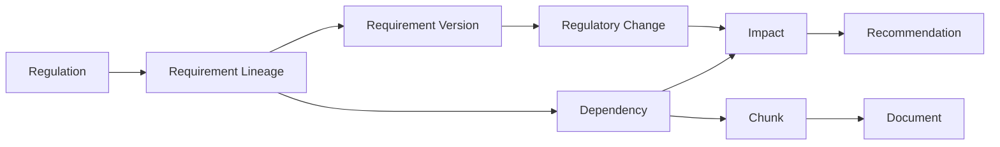

# Ripple — MVP Product Requirements

**Version:** 1.0
**Status:** Ready to build
**Deployment target:** Runs entirely on a developer's laptop. One external dependency: an OpenAI API key.
**Audience:** An AI coding agent building the MVP end to end.

---

## 0. How to use this document

This is a build spec, not a pitch. Sections 6–14 are normative — build exactly what is written there. Where the original product notes left a decision open, this document states a default and marks it `[DEFAULT]`. Change a `[DEFAULT]` only if the user asks.

`MUST`, `SHOULD`, `MAY` carry their usual RFC-2119 meaning.

**The single external service is OpenAI.** One `OPENAI_API_KEY` powers embeddings, semantic retrieval, requirement extraction, dependency adjudication, impact analysis, and suggested amendments. There is no other API key, no cloud database, and no hosted storage. Ripple is multi-user, but there are no passwords and no identity provider: you pick a name and that becomes your point of view. The one-outbound-dependency claim holds.

---

## 1. Product summary

**Ripple** is a regulatory dependency mapping system for legal teams.

It maintains a granular link between (a) atomic requirements extracted from external regulations and (b) the exact sentences and clauses inside an organisation's internal legal documents that depend on those requirements. When a regulation changes, Ripple propagates the change through those links and shows the lawyer precisely which documents, sections, and sentences now need review — with an assessment, a confidence score, and a proposed redline.

**The differentiator is granularity.** Competing regulatory-change tools map `Regulation → Policy`. Ripple maps:

```
Regulation → Regulatory Requirement → Document → Section → Specific sentence/clause
```

**The one-sentence value claim:** we do not tell you a regulation changed; we show you what that change breaks.

---

## 2. Users and the core job

**Primary user:** an in-house lawyer, law-firm associate, or legal-ops professional responsible for maintaining internal policies, playbooks, templates, and standard clauses.

**Job to be done:** *"A rule changed. Exactly what internal content do I now have to review?"*

**Secondary job:** *"Before anything changes, show me which of my documents depend on which rules, and let me search my corpus by meaning."* The dependency map and semantic search have standalone value before any amendment arrives.

**Accounts.** Ripple is multi-user within one organisation — a legal department or a firm. There are no passwords: the install ships with three named accounts and you choose which one you are. Choosing a name selects a point of view, it does not authenticate anyone, and §5.5 is explicit about what that does and does not buy you.

The access model has one asymmetry, and it is the point:

- **Regulations and requirements are organisation-wide.** Every member sees the same base policies. Only an admin can add or amend them. If any member could add a base policy, it would not be a shared baseline.
- **Internal documents are owned.** A document belongs to the member who uploaded it and is visible to that member, to anyone they tag on it, and to admins. Everything derived from a document — its chunks, dependencies, impacts, recommendations — inherits that visibility exactly.

So two members see one shared body of law and two different bodies of internal content, and each is told only about the ripple that reaches their own documents. Section 5 specifies this.

---

## 3. Core concepts

| Concept | Definition |
|---|---|
| **Regulation** | An uploaded external source document: statute, amendment, regulatory notice, guidance, court decision, consultation paper. |
| **Regulatory requirement** | One *atomic* obligation extracted from a regulation. Atomic = one subject, one obligation, independently citable. |
| **Requirement lineage** | The stable identity of a requirement across versions (e.g. `REQ-001` = "cannabis possession threshold"). Requirement *versions* attach to a lineage. Dependencies point at the lineage, so a new version never orphans the map. |
| **Document** | An uploaded internal document Ripple monitors. |
| **Chunk** | A retrievable unit of an internal document: normally one paragraph, clause, list item, or table row, carrying its section path and page number. |
| **Dependency** | A stored link `requirement lineage → chunk`, with a confidence score, a relationship type, and the exact evidence span. |
| **Regulatory change** | A detected difference between two versions of a requirement lineage, or a requirement being added or removed. |
| **Impact** | The evaluation of one dependency against one regulatory change: a level, a confidence, and a written reason. |
| **Recommendation** | A proposed replacement text for the affected chunk, awaiting the lawyer's accept / edit / reject. |
| **Simulation** | A hypothetical edit to one or more requirements, run through the same propagation engine without altering anything stored. Answers *"if this rule changed, what would break?"* before the rule has changed — or without it ever changing. |

Entity chain:



---

## 4. Scope

### 4.1 In scope (MVP)

1. Local multi-user accounts within one organisation: org-wide regulations, per-member documents, tagging colleagues onto a document.
2. Upload regulatory PDFs; extract atomic requirements.
3. Upload internal documents (PDF, DOCX, TXT) at any time, one or many, growing the corpus incrementally; parse into section-aware chunks.
4. Embed everything and provide **semantic search** across both corpora.
5. Map chunks to requirements at sentence/clause granularity, with confidence and evidence spans, in both directions — requirement-first when a rule is new, document-first when a document is new.
6. **Scan for changes** on three triggers: a policy edit, a document being added, or the user pressing the button.
7. Upload an amending regulation; diff its requirements against the stored set.
8. **Simulate** a change directly on a stored requirement — alter the threshold, the period, or the wording without uploading anything — and see the same ripple. Simulations are disposable and never alter the stored requirement unless explicitly promoted.
9. Propagate each change through stored dependencies; classify impact.
10. Present a dashboard, a change page, a document reader with inline dependency highlighting, and an affected-content review page with side-by-side regulatory and internal text.
11. Present a **dependency graph** view showing, in one picture, what depends on what and what a given change does and does not reach.
12. Generate a suggested amendment per affected item; the lawyer accepts, edits, or rejects.
13. Ripple never writes back into the source document. Recommendations are records only.

### 4.2 Out of scope (do not build)

- Any cloud deployment, hosted database, or managed storage. Local only.
- Authentication of any kind: passwords, SSO, OAuth, SAML, SCIM, MFA, email verification. You pick a name from a list.
- More than one organisation per install, cross-organisation sharing, or public links.
- Per-section or per-field permissions. Visibility is per document and nothing finer.
- Live regulatory monitoring, web scraping, or regulatory data APIs.
- Multi-jurisdiction modelling or jurisdiction-aware conflict resolution.
- Automated legal advice, or any action taken without lawyer review.
- Automatic modification or regeneration of the source document file.
- Autonomous agents or long-running agent loops.
- Slack / Teams / email integrations and notifications.
- Fine-tuned or custom-trained models.
- Contract lifecycle management, e-signature, matter management, regulatory filing.
- A graph database or formal knowledge-graph infrastructure. A relational model with indexed foreign keys is sufficient and is what this spec defines.
- Real-time collaboration, comments, assignment, or workflow features.
- OCR of scanned documents.

---

## 5. Runtime architecture (local-first)

### 5.1 Processes

Three things run on the developer's machine:

| Process | Stack | Port |
|---|---|---|
| API | Python 3.11+, FastAPI, Uvicorn | `8000` |
| Web | Next.js (App Router), React, Tailwind CSS, shadcn/ui | `3000` |
| Database | SQLite file at `./data/ripple.db` (in-process, no server) | — |

Uploaded files live on disk at `./data/files/regulations/` and `./data/files/documents/`, named `{uuid}{ext}`. The API serves them back over `GET /api/v1/files/{kind}/{id}`; there are no signed URLs because nothing leaves the machine.

`[DEFAULT]` **SQLite, not Postgres.** Rationale: zero setup, no Docker, no daemon — which is what "runs locally" has to mean for this to be demoable in one command. Vector search uses the [`sqlite-vec`](https://github.com/asg017/sqlite-vec) extension (`vec0` virtual tables); lexical search uses SQLite's built-in FTS5. Both load as extensions from the Python `sqlite3` connection; no external service.

The schema in section 6 is written to port cleanly to Postgres + pgvector later — see section 16.

### 5.2 Startup

A single entrypoint MUST exist:

```
python run.py install    # create the venv, install Python and npm dependencies
python run.py dev        # start API and web together; Ctrl+C stops both
python run.py seed       # load the reference demo corpus from section 15
python run.py test       # run the pytest suite
python run.py reindex    # rebuild the vec_* and fts_* mirror tables
```

`[DEFAULT]` **A single Python entrypoint, not a Makefile.** Python is already a hard dependency; GNU make is not present on a default Windows machine, and maintaining a Makefile plus PowerShell equivalents means writing every task twice and having them drift. `run.py` uses only the standard library (`argparse`, `subprocess`, `venv`, `pathlib`), runs identically on Windows, macOS, and Linux, and is the single place task automation lives. `dev` supervises both child processes and terminates both on Ctrl+C or on either one exiting. Every command prints what it is about to do before doing it, and fails with a readable message naming the fix — never a traceback as the primary error surface.

On boot the API MUST: create `./data/` if absent, run migrations, load `sqlite-vec`, verify `OPENAI_API_KEY` is set, and — if the `users` table is empty — insert the three default accounts from §5.5. A missing key is a fatal startup error with a clear message, never a silent fallback to keyword-only behaviour. There is no setup step and no first-run wizard: `python run.py install && python run.py dev` on a clean checkout reaches a usable app.

### 5.3 Configuration

`.env` at the repository root, with `.env.example` committed:

```
OPENAI_API_KEY=sk-...
OPENAI_BASE_URL=https://api.openai.com/v1     # override for a local/proxy endpoint
RIPPLE_EMBEDDING_MODEL=text-embedding-3-small # 1536 dims
RIPPLE_REASONING_MODEL=gpt-4.1                # extraction, impact, recommendations
RIPPLE_BULK_MODEL=gpt-4.1-mini                # dependency adjudication (high volume)
RIPPLE_DATA_DIR=./data
RIPPLE_MAX_CONCURRENT_LLM_CALLS=5
NEXT_PUBLIC_API_BASE_URL=http://localhost:8000/api/v1
```

Model names are configuration, not hard-coded constants. `OPENAI_BASE_URL` exists so the whole system can be pointed at a local OpenAI-compatible server later without code changes; embedding dimensionality is read from the first successful embedding response and asserted against the schema on boot.

### 5.4 Job model

`[DEFAULT]` All ingestion and analysis is asynchronous. Every upload/analysis endpoint returns `202` with a `job_id`; the client polls `GET /jobs/{job_id}`. Jobs run in FastAPI `BackgroundTasks` inside the API process, with state persisted in a `jobs` table so progress survives a page refresh and a crash is visible rather than silent. No Celery, no Redis, no broker.

Job types: `regulation_ingest`, `document_ingest`, `dependency_mapping`, `change_detection`, `impact_analysis`, `simulation_run`, `scan`.

### 5.5 Accounts and access control

One organisation per install. Two roles: `admin` and `member`.

**No passwords.** On first boot Ripple creates three accounts and nothing else:

| Name | Role |
|---|---|
| Priya Menon | `admin` |
| Alex Tan | `member` |
| Sam Rahim | `member` |

You choose one from a list and that becomes your session. Switching is a menu item, not a logout-and-login. A session is an opaque random id in an httpOnly, SameSite=Lax cookie, looked up in `sessions`, expiring after 30 days. No hashing, no rate limiting, no reset flow, because there is no secret to protect.

**What this is and is not.** Choosing a name selects a **point of view**, not a permission level. Everything below determines what each person is *shown*; none of it stops anyone with access to the app from switching to another name and seeing that person's documents. This is deliberate for a local prototype, and it must be stated in the interface — the account menu carries the line *"Accounts are not secured. Anyone using this install can view as anyone."*

The distinction matters for how you build it, not just how you describe it. The scoping rules below must still be implemented exactly and tested exactly, because they are the product behaviour — a member seeing a colleague's document in their impact list is a bug whether or not it is a breach. What changes is the claim you may make about them: this is a filter, not a boundary.

**The resource matrix.** This table is the specification; the API is not permitted to deviate from it.

| Resource | Read | Write |
|---|---|---|
| Regulations, requirement lineages, requirement versions | Every member | Admins only |
| Regulatory changes with `source` = `amendment` or `manual` | Every member | Admins only |
| Documents, chunks | Owner, tagged collaborators, admins | Owner and `reviewer` collaborators; admins |
| Dependencies | Follows the document | Follows the document |
| Impacts, recommendations | Follows the document | Owner, `reviewer` collaborators, admins |
| Simulations | Creator and admins | Creator and admins |
| Users | Everyone sees the roster — you cannot tag someone you cannot name | Admins only |
| Scans | Initiator and admins | Any member (scoped to what they can see) |

**One accessor, everywhere.** The service layer exposes exactly one function, `visible_document_ids(user)`, returning owned ∪ tagged ∪ (all, if admin). Every query that touches documents, chunks, dependencies, impacts, or recommendations filters through it. There is no second path. Counts, dashboards, search results, graph nodes, and export files are all filtered by it — a member must not be able to infer the existence of a colleague's document from a count.

**Shared law, private practice.** A change to a base policy fans out to every member's documents, but each member is shown only the part of that fan-out that lands on documents they can see. An admin opening the same change sees all of it. This is the intended asymmetry, not a leak.

**Simulations respect it too.** A simulation run by a member evaluates only that member's visible dependencies, so the impact counts on a simulation differ by who ran it. State this on the simulation page — a member must not read "3 affected documents" as an organisational total.

**Deletion.** Deleting a user requires reassigning their documents to another member; the API refuses otherwise rather than orphaning or cascading a corpus. The three default accounts may be renamed but not deleted below one admin.

---

## 6. Data model

SQLite. Types below use SQLite affinities; `TEXT` holds UUIDs (generated in Python as `uuid4().hex`) and ISO-8601 timestamps. `CHECK` constraints are enforced by SQLite and MUST be present.

Vectors are stored in `sqlite-vec` `vec0` virtual tables keyed by the owning row's id — SQLite has no native vector column.

```sql
PRAGMA journal_mode = WAL;
PRAGMA foreign_keys = ON;

-- ---------- accounts ----------
CREATE TABLE organizations (
  id         TEXT PRIMARY KEY,
  name       TEXT NOT NULL,
  created_at TEXT NOT NULL
);
-- Exactly one row. Enforced by a trigger; the column exists so the Postgres
-- port in section 16 is a filter change, not a schema change.

-- No credentials. Seeded with three rows on first boot (§5.5).
CREATE TABLE users (
  id            TEXT PRIMARY KEY,
  display_name  TEXT NOT NULL UNIQUE COLLATE NOCASE,
  role          TEXT NOT NULL DEFAULT 'member' CHECK (role IN ('admin','member')),
  created_at    TEXT NOT NULL,
  last_seen_at  TEXT
);

CREATE TABLE sessions (
  id         TEXT PRIMARY KEY,                    -- opaque 256-bit random id, held in the cookie
  user_id    TEXT NOT NULL REFERENCES users(id) ON DELETE CASCADE,
  created_at TEXT NOT NULL,
  expires_at TEXT NOT NULL
);
CREATE INDEX idx_sessions_user ON sessions(user_id, expires_at);

-- ---------- regulations ----------
CREATE TABLE regulations (
  id                   TEXT PRIMARY KEY,
  title                TEXT NOT NULL,
  short_name           TEXT,
  jurisdiction         TEXT,
  document_kind        TEXT NOT NULL DEFAULT 'primary'
                       CHECK (document_kind IN ('primary','amendment','guidance','notice','decision','consultation')),
  amends_regulation_id TEXT REFERENCES regulations(id) ON DELETE SET NULL,
  effective_date       TEXT,                       -- ISO date
  file_path            TEXT NOT NULL,              -- relative to RIPPLE_DATA_DIR
  file_name            TEXT NOT NULL,
  page_count           INTEGER,
  status               TEXT NOT NULL DEFAULT 'pending'
                       CHECK (status IN ('pending','processing','ready','failed')),
  error_message        TEXT,
  created_at           TEXT NOT NULL
);

-- Stable identity of a requirement across amendments.
CREATE TABLE requirement_lineages (
  id                   TEXT PRIMARY KEY,
  public_ref           TEXT NOT NULL UNIQUE,       -- 'REQ-001'
  subject              TEXT NOT NULL,              -- snake_case, e.g. 'cannabis_possession'
  origin_regulation_id TEXT NOT NULL REFERENCES regulations(id) ON DELETE CASCADE,
  current_version_id   TEXT,                       -- -> regulatory_requirements.id
  created_at           TEXT NOT NULL
);
CREATE INDEX idx_lineage_subject ON requirement_lineages(subject);

CREATE TABLE regulatory_requirements (
  id               TEXT PRIMARY KEY,
  lineage_id       TEXT NOT NULL REFERENCES requirement_lineages(id) ON DELETE CASCADE,
  regulation_id    TEXT NOT NULL REFERENCES regulations(id) ON DELETE CASCADE,
  version          INTEGER NOT NULL DEFAULT 1,
  requirement_text TEXT NOT NULL,                  -- one-sentence normalised statement
  verbatim_text    TEXT,                           -- quoted source sentence(s)
  requirement_type TEXT NOT NULL
                   CHECK (requirement_type IN ('threshold','duration','prohibition','obligation',
                                               'definition','notification','exception','procedure','other')),
  subject          TEXT NOT NULL,
  value            TEXT,                           -- normalised display value, e.g. '15 g', '7 years'
  value_numeric    REAL,
  value_unit       TEXT,                           -- 'g', 'years', 'days', 'SGD'
  comparator       TEXT CHECK (comparator IN ('gt','gte','lt','lte','eq','between') OR comparator IS NULL),
  condition        TEXT,
  exception        TEXT,
  source_section   TEXT,                           -- 'Section 12(2)'
  source_page      INTEGER,
  effective_date   TEXT,
  origin           TEXT NOT NULL DEFAULT 'extracted'
                   CHECK (origin IN ('extracted','manual')),
  superseded_by    TEXT REFERENCES regulatory_requirements(id) ON DELETE SET NULL,
  is_current       INTEGER NOT NULL DEFAULT 1,
  created_at       TEXT NOT NULL,
  UNIQUE (lineage_id, version)
);
CREATE INDEX idx_req_current ON regulatory_requirements(is_current);
CREATE INDEX idx_req_lineage ON regulatory_requirements(lineage_id, version DESC);

-- ---------- internal documents ----------
CREATE TABLE documents (
  id            TEXT PRIMARY KEY,
  owner_id      TEXT NOT NULL REFERENCES users(id) ON DELETE RESTRICT,
  name          TEXT NOT NULL,
  doc_type      TEXT NOT NULL DEFAULT 'policy'
                CHECK (doc_type IN ('policy','playbook','sop','template','clause_library',
                                    'checklist','opinion','advisory','training','other')),
  version_label TEXT,
  file_path     TEXT NOT NULL,
  file_name     TEXT NOT NULL,
  mime_type     TEXT NOT NULL,
  page_count    INTEGER,
  status        TEXT NOT NULL DEFAULT 'pending'
                CHECK (status IN ('pending','processing','ready','failed')),
  error_message TEXT,
  created_at    TEXT NOT NULL
);
CREATE INDEX idx_documents_owner ON documents(owner_id, created_at DESC);

-- People tagged onto a document at upload time or later.
CREATE TABLE document_collaborators (
  document_id TEXT NOT NULL REFERENCES documents(id) ON DELETE CASCADE,
  user_id     TEXT NOT NULL REFERENCES users(id) ON DELETE CASCADE,
  access      TEXT NOT NULL DEFAULT 'reviewer' CHECK (access IN ('viewer','reviewer')),
  added_by    TEXT NOT NULL REFERENCES users(id) ON DELETE RESTRICT,
  added_at    TEXT NOT NULL,
  PRIMARY KEY (document_id, user_id)
);
CREATE INDEX idx_collab_user ON document_collaborators(user_id);

CREATE TABLE document_chunks (
  id            TEXT PRIMARY KEY,
  document_id   TEXT NOT NULL REFERENCES documents(id) ON DELETE CASCADE,
  ordinal       INTEGER NOT NULL,                  -- 0-based order within the document
  content       TEXT NOT NULL,
  section_path  TEXT,                              -- 'Part III > 4.2 Prohibited Substances'
  section_title TEXT,
  page_number   INTEGER,
  char_start    INTEGER,                           -- offset into the document's full extracted text
  char_end      INTEGER,
  chunk_type    TEXT NOT NULL DEFAULT 'paragraph'
                CHECK (chunk_type IN ('paragraph','heading','list_item','table_row','other')),
  created_at    TEXT NOT NULL,
  UNIQUE (document_id, ordinal)
);
CREATE INDEX idx_chunk_doc ON document_chunks(document_id, ordinal);

-- ---------- scans ----------
-- Defined before mapping_passes and dependencies because both reference it.
CREATE TABLE scans (
  id                TEXT PRIMARY KEY,
  trigger           TEXT NOT NULL
                    CHECK (trigger IN ('policy_change','document_added','manual','simulation')),
  scope             TEXT NOT NULL DEFAULT 'stale'
                    CHECK (scope IN ('stale','full','document','lineage')),
  scope_id          TEXT,                          -- document_id or lineage_id when scope is narrowed
  initiated_by      TEXT REFERENCES users(id) ON DELETE SET NULL,   -- NULL for automatic scans
  status            TEXT NOT NULL DEFAULT 'queued'
                    CHECK (status IN ('queued','running','succeeded','failed')),
  -- What the scan found and did. Written incrementally so the UI can narrate progress.
  documents_scanned     INTEGER NOT NULL DEFAULT 0,
  requirements_scanned  INTEGER NOT NULL DEFAULT 0,
  dependencies_added    INTEGER NOT NULL DEFAULT 0,
  dependencies_removed  INTEGER NOT NULL DEFAULT 0,
  impacts_created       INTEGER NOT NULL DEFAULT 0,
  new_high_impacts      INTEGER NOT NULL DEFAULT 0,
  estimated_cost_usd    REAL NOT NULL DEFAULT 0,
  error_message     TEXT,
  started_at        TEXT,
  finished_at       TEXT,
  created_at        TEXT NOT NULL
);
CREATE INDEX idx_scans_recent ON scans(created_at DESC);

-- ---------- the dependency map ----------
CREATE TABLE dependencies (
  id                TEXT PRIMARY KEY,
  lineage_id        TEXT NOT NULL REFERENCES requirement_lineages(id) ON DELETE CASCADE,
  document_chunk_id TEXT NOT NULL REFERENCES document_chunks(id) ON DELETE CASCADE,
  document_id       TEXT NOT NULL REFERENCES documents(id) ON DELETE CASCADE,   -- denormalised for filtering
  relationship_type TEXT NOT NULL
                    CHECK (relationship_type IN ('restates','implements','references','defines')),
  confidence        REAL NOT NULL CHECK (confidence BETWEEN 0 AND 1),
  rationale         TEXT NOT NULL,
  evidence_span     TEXT,                          -- exact substring of chunk.content carrying the dependency
  evidence_start    INTEGER,
  evidence_end      INTEGER,
  status            TEXT NOT NULL DEFAULT 'active'
                    CHECK (status IN ('active','dismissed')),
  found_by_scan_id  TEXT REFERENCES scans(id) ON DELETE SET NULL,
  created_at        TEXT NOT NULL,
  UNIQUE (lineage_id, document_chunk_id)
);
CREATE INDEX idx_dep_lineage ON dependencies(lineage_id, status);
CREATE INDEX idx_dep_document ON dependencies(document_id, status);

-- Evidence that a document was checked against a requirement, INCLUDING when nothing matched.
-- This is what lets Ripple say "checked against 214 requirements, 3 matched" instead of
-- silently implying absence. It is also how the scanner knows what is stale.
CREATE TABLE mapping_passes (
  document_id      TEXT NOT NULL REFERENCES documents(id) ON DELETE CASCADE,
  lineage_id       TEXT NOT NULL REFERENCES requirement_lineages(id) ON DELETE CASCADE,
  direction        TEXT NOT NULL CHECK (direction IN ('requirement_first','document_first')),
  dependency_found INTEGER NOT NULL DEFAULT 0,
  candidates_seen  INTEGER NOT NULL DEFAULT 0,
  scan_id          TEXT REFERENCES scans(id) ON DELETE SET NULL,
  mapped_at        TEXT NOT NULL,
  PRIMARY KEY (document_id, lineage_id)
);
CREATE INDEX idx_pass_lineage ON mapping_passes(lineage_id);

-- ---------- what-if simulation ----------
-- A simulation is a set of proposed edits to stored requirements that has NOT been applied.
-- Running one produces regulatory_changes rows tagged with simulation_id; everything
-- downstream (impacts, recommendations, the review UI) is identical to a real change.
CREATE TABLE simulations (
  id          TEXT PRIMARY KEY,
  created_by  TEXT NOT NULL REFERENCES users(id) ON DELETE CASCADE,
  name        TEXT NOT NULL,                      -- 'PDPA consultation: 5y -> 7y'
  note        TEXT,
  status      TEXT NOT NULL DEFAULT 'draft'
              CHECK (status IN ('draft','running','complete','failed','promoted','discarded')),
  created_at  TEXT NOT NULL,
  updated_at  TEXT NOT NULL
);

CREATE TABLE simulation_edits (
  id                    TEXT PRIMARY KEY,
  simulation_id         TEXT NOT NULL REFERENCES simulations(id) ON DELETE CASCADE,
  lineage_id            TEXT REFERENCES requirement_lineages(id) ON DELETE CASCADE,
  op                    TEXT NOT NULL CHECK (op IN ('modify','repeal','add')),
  -- Proposed field values. NULL means "unchanged from the current version".
  -- For op='add' these define the hypothetical new requirement; lineage_id is NULL.
  proposed_requirement_text TEXT,
  proposed_value            TEXT,
  proposed_value_numeric    REAL,
  proposed_value_unit       TEXT,
  proposed_comparator       TEXT,
  proposed_condition        TEXT,
  proposed_exception        TEXT,
  proposed_effective_date   TEXT,
  created_at            TEXT NOT NULL,
  CHECK ((op = 'add' AND lineage_id IS NULL) OR (op <> 'add' AND lineage_id IS NOT NULL))
);
CREATE INDEX idx_simedit_sim ON simulation_edits(simulation_id);

-- ---------- change detection ----------
CREATE TABLE regulatory_changes (
  id                          TEXT PRIMARY KEY,
  lineage_id                  TEXT NOT NULL REFERENCES requirement_lineages(id) ON DELETE CASCADE,
  source                      TEXT NOT NULL DEFAULT 'amendment'
                              CHECK (source IN ('amendment','manual','simulation')),
  detected_from_regulation_id TEXT REFERENCES regulations(id) ON DELETE CASCADE,  -- NULL for manual/simulation
  simulation_id               TEXT REFERENCES simulations(id) ON DELETE CASCADE,  -- NULL unless source='simulation'
  previous_requirement_id     TEXT REFERENCES regulatory_requirements(id) ON DELETE SET NULL,
  new_requirement_id          TEXT REFERENCES regulatory_requirements(id) ON DELETE SET NULL,
  proposed_snapshot           TEXT,               -- JSON of the hypothetical requirement, when it has no stored row
  change_type                 TEXT NOT NULL
                              CHECK (change_type IN ('added','removed','threshold','duration','scope',
                                                     'definition','obligation','exception',
                                                     'effective_date','editorial')),
  old_value                   TEXT,
  new_value                   TEXT,
  summary                     TEXT NOT NULL,       -- 'Possession threshold: 30 g -> 15 g'
  source_section              TEXT,
  effective_date              TEXT,
  analysis_status             TEXT NOT NULL DEFAULT 'pending'
                              CHECK (analysis_status IN ('pending','analysing','complete','failed')),
  created_at                  TEXT NOT NULL,
  CHECK ((source = 'amendment'  AND detected_from_regulation_id IS NOT NULL AND simulation_id IS NULL)
      OR (source = 'manual'     AND simulation_id IS NULL)
      OR (source = 'simulation' AND simulation_id IS NOT NULL))
);
CREATE INDEX idx_change_simulation ON regulatory_changes(simulation_id);
CREATE INDEX idx_change_source ON regulatory_changes(source, created_at DESC);

CREATE TABLE impacts (
  id                   TEXT PRIMARY KEY,
  regulatory_change_id TEXT NOT NULL REFERENCES regulatory_changes(id) ON DELETE CASCADE,
  dependency_id        TEXT NOT NULL REFERENCES dependencies(id) ON DELETE CASCADE,
  document_id          TEXT NOT NULL REFERENCES documents(id) ON DELETE CASCADE,
  document_chunk_id    TEXT NOT NULL REFERENCES document_chunks(id) ON DELETE CASCADE,
  impact_level         TEXT NOT NULL CHECK (impact_level IN ('high','medium','low','none')),
  confidence           REAL NOT NULL CHECK (confidence BETWEEN 0 AND 1),
  reason               TEXT NOT NULL,
  conflicting_span     TEXT,                       -- exact substring of the chunk now contradicted
  conflicting_start    INTEGER,
  conflicting_end      INTEGER,
  review_status        TEXT NOT NULL DEFAULT 'open'
                       CHECK (review_status IN ('open','in_review','resolved','dismissed')),
  assigned_to          TEXT REFERENCES users(id) ON DELETE SET NULL,
  resolved_by          TEXT REFERENCES users(id) ON DELETE SET NULL,
  resolved_at          TEXT,
  created_by_scan_id   TEXT REFERENCES scans(id) ON DELETE SET NULL,
  created_at           TEXT NOT NULL,
  UNIQUE (regulatory_change_id, dependency_id)
);
CREATE INDEX idx_impact_change ON impacts(regulatory_change_id, impact_level);
CREATE INDEX idx_impact_review ON impacts(review_status);

CREATE TABLE recommendations (
  id             TEXT PRIMARY KEY,
  impact_id      TEXT NOT NULL REFERENCES impacts(id) ON DELETE CASCADE,
  current_text   TEXT NOT NULL,
  suggested_text TEXT NOT NULL,
  rationale      TEXT NOT NULL,
  requires_human_decision INTEGER NOT NULL DEFAULT 0,
  decision_note  TEXT,
  status         TEXT NOT NULL DEFAULT 'proposed'
                 CHECK (status IN ('proposed','accepted','edited','rejected')),
  edited_text    TEXT,
  decided_by     TEXT REFERENCES users(id) ON DELETE SET NULL,
  decided_at     TEXT,
  created_at     TEXT NOT NULL
);
CREATE INDEX idx_rec_impact ON recommendations(impact_id);

-- ---------- async work ----------
CREATE TABLE jobs (
  id            TEXT PRIMARY KEY,
  job_type      TEXT NOT NULL,
  subject_type  TEXT NOT NULL,                     -- 'regulation' | 'document' | 'regulatory_change'
  subject_id    TEXT NOT NULL,
  status        TEXT NOT NULL DEFAULT 'queued'
                CHECK (status IN ('queued','running','succeeded','failed')),
  progress      REAL NOT NULL DEFAULT 0,
  step          TEXT,                              -- human-readable current step
  error_message TEXT,
  result        TEXT,                              -- JSON
  created_at    TEXT NOT NULL,
  updated_at    TEXT NOT NULL
);
CREATE INDEX idx_jobs_recent ON jobs(created_at DESC);
```

### 6.1 Vector and full-text tables

```sql
-- sqlite-vec. Dimension MUST match RIPPLE_EMBEDDING_MODEL (1536 for text-embedding-3-small).
CREATE VIRTUAL TABLE vec_chunks USING vec0(
  chunk_id TEXT PRIMARY KEY,
  embedding FLOAT[1536]
);

CREATE VIRTUAL TABLE vec_requirements USING vec0(
  requirement_id TEXT PRIMARY KEY,
  embedding FLOAT[1536]
);

-- FTS5 for lexical retrieval and keyword search.
CREATE VIRTUAL TABLE fts_chunks USING fts5(
  chunk_id UNINDEXED,
  content,
  section_path,
  tokenize = 'porter unicode61'
);

CREATE VIRTUAL TABLE fts_requirements USING fts5(
  requirement_id UNINDEXED,
  requirement_text,
  verbatim_text,
  tokenize = 'porter unicode61'
);
```

Both mirror tables are written in the same transaction as their base row, and rebuilt by a `scripts/reindex.py` for recovery. If the configured embedding model's dimensionality does not match the `vec0` declaration, the API MUST fail at boot with an instruction to run `scripts/reindex.py --dims N`.

---

## 7. Processing pipeline

All LLM calls use the OpenAI **Chat Completions** API with **Structured Outputs** (`response_format: {type: "json_schema", json_schema: {..., strict: true}}`). Never parse free-form text into a database field. Every schema sets `additionalProperties: false` and lists every property in `required`.

### 7.1 Stage 1 — Regulatory PDF parsing

Input: an uploaded PDF. Output: page-numbered text with detected section headings.

- `[DEFAULT]` Use `pymupdf` (`fitz`). Preserve reading order; drop repeated headers and footers by detecting lines that recur on ≥ 60% of pages.
- Detect section markers with a regex ladder, run in order: `^(Part|PART)\s+[IVXLC]+`, `^\d+\.(\d+)*`, `^\(\d+\)`, `^\([a-z]\)`, `^(Section|Reg\.|Regulation|Article)\s+\d+`. The most recent match becomes the current `source_section`.
- If ≥ 30% of pages yield under 40 characters of text, treat the PDF as scanned: fail the job with `error_message = "Scanned PDF — OCR is not supported in the MVP"`. Never produce silently empty output.

### 7.2 Stage 2 — Requirement extraction

Model: `RIPPLE_REASONING_MODEL`. Structured output.

Windowing: feed the regulation in overlapping windows of ~12,000 tokens with 800 tokens of overlap, each window prefixed with the running section context. Deduplicate results on `(subject, source_section)`.

System prompt (binding rules):

> You extract atomic legal requirements from regulatory text. An atomic requirement states exactly one obligation about exactly one subject and can be cited on its own. Split compound sentences into separate requirements. Never infer a requirement the text does not state. Quote the source sentence verbatim in `verbatim_text`. If a numeric limit is present, normalise it into `value_numeric` and `value_unit` and set the comparator. Return only text that creates, modifies, or defines a legal obligation — skip recitals, preambles, and commencement boilerplate, except where they set an effective date. Where the reference list of existing subjects contains a subject covering the same ground, reuse that exact subject string.

Output schema:

```json
{
  "requirements": [
    {
      "requirement_text": "Possession of more than 15 g of cannabis is prohibited.",
      "verbatim_text": "No person shall have in his possession cannabis exceeding 15 grammes.",
      "requirement_type": "threshold",
      "subject": "cannabis_possession",
      "value": "15 g",
      "value_numeric": 15,
      "value_unit": "g",
      "comparator": "gt",
      "condition": null,
      "exception": "Licensed medical suppliers under Section 14.",
      "source_section": "Section 12(2)",
      "source_page": 8,
      "effective_date": "2026-01-01",
      "repeals_sections": []
    }
  ]
}
```

`subject` MUST be snake_case and stable in meaning — it is the primary key for change matching. The existing `(public_ref, subject, requirement_text)` list is passed into the prompt as reference context so the model reuses subjects rather than inventing synonyms.

### 7.3 Stage 3 — Internal document parsing and chunking

- PDF → `pymupdf`. DOCX → `python-docx`, using paragraph styles (`Heading 1..6`) to build `section_path` and reading tables row by row. TXT → split on blank lines.
- A chunk is one paragraph, list item, or table row. `[DEFAULT]` Merge chunks under 200 characters into the following chunk; hard-split chunks over 1,500 characters at sentence boundaries.
- Headings become `chunk_type = 'heading'`, are not mapped, and populate the `section_path` of the chunks that follow.
- `section_path` is the breadcrumb of every enclosing heading joined by ` > `; `section_title` is the nearest heading.
- Record `char_start` / `char_end` against the document's full extracted text so the reader can show surrounding context.

### 7.4 Stage 4 — Embeddings

Model: `RIPPLE_EMBEDDING_MODEL` (`[DEFAULT]` `text-embedding-3-small`, 1536 dimensions — the cost/quality point that makes a 50-document corpus embed for cents).

Embed:

- every `document_chunk` where `chunk_type != 'heading'` and `length(content) >= 60`, using the text `"{section_path}\n{content}"` so section context contributes to the vector;
- every `regulatory_requirement`, using `"{requirement_text} {verbatim_text}"`.

Batch up to 128 inputs per request. Persist to `vec_chunks` / `vec_requirements` in the same transaction as the base row. Embedding failures fail the batch, not the job; the job reports how many items are unembedded and a `scripts/reindex.py` can fill the gap.

### 7.5 Stage 5 — Semantic search

Semantic search is a first-class feature, not just internal plumbing. `GET /search` (section 9.7) runs a hybrid query and is exposed at `/search` in the UI.

1. Embed the query.
2. **Vector leg** — `vec_chunks` / `vec_requirements` k-NN, `k = 40`, cosine distance.
3. **Lexical leg** — FTS5 `bm25()` over the same corpora, top 40.
4. **Fuse** with Reciprocal Rank Fusion: `score = Σ 1 / (60 + rank_i)` across both legs. `[DEFAULT]` RRF rather than a tuned weighted sum — it needs no score normalisation between two incomparable scales.
5. Return the top 20 with a snippet, the section path, the page, and the fused score.

### 7.6 Stage 6 — Dependency mapping

For each current requirement, build a candidate chunk set with the same hybrid retrieval, then adjudicate with the LLM.

**Retrieval:**

1. **Vector:** top 40 chunks by cosine similarity to the requirement embedding, similarity ≥ 0.45.
2. **Lexical:** FTS5 query built from high-signal tokens — the numeric value and unit and its surface variants (`30g`, `30 g`, `30 grammes`), the subject words, and any quoted defined term. Cap at 40.

Fuse with RRF, deduplicate, cap the union at 60 chunks per requirement.

**Adjudication:** batches of 8 candidates per call, model `RIPPLE_BULK_MODEL`, structured output. The prompt supplies the requirement's structured fields and the candidates (id, section path, content).

System prompt (binding rules):

> Decide, for each candidate passage, whether it *depends* on the given regulatory requirement. A passage depends on the requirement if changing the requirement would oblige a lawyer to review that passage. Classify the relationship: `restates` (the passage reproduces the rule or its value), `implements` (the passage operationalises the rule without quoting it), `references` (the passage defers to the rule generically, e.g. "as required by applicable law"), `defines` (the passage defines a term the rule turns on). If a passage merely shares vocabulary with the requirement, it does not depend on it — return `depends: false`. When it does depend, return the exact substring of the passage that carries the dependency, copied character for character.

Output per candidate: `{chunk_id, depends, relationship_type, confidence, rationale, evidence_span}`.

**Persistence:**

- `[DEFAULT]` Store a row when `depends = true` and `confidence >= 0.60`.
- `[DEFAULT]` Show in the UI by default at `confidence >= 0.70`; below that, behind a "Low confidence" disclosure.
- Resolve `evidence_start` / `evidence_end` by locating `evidence_span` in `chunk.content`; retry case-insensitively and whitespace-normalised. If still not found, store the dependency with null offsets rather than dropping it.

**The reverse direction — document-first.** The procedure above is *requirement-first*: hold a requirement, find the chunks that depend on it. That is the right shape when a **requirement** is new. When a **document** is new it is the wrong shape and roughly three times the cost, because you would sweep every requirement across a corpus that has not changed.

For a new document, invert it. For each chunk:

1. Retrieve candidate requirements: top 15 from `vec_requirements` by cosine similarity ≥ 0.45, unioned with the top 15 from `fts_requirements`, fused with RRF, capped at 20.
2. Adjudicate one chunk against up to 8 candidate requirements per call, using the same prompt, the same relationship taxonomy, the same output schema, and the same thresholds. Only the framing swaps: one passage, several rules.
3. Write the resulting dependencies, and write a `mapping_passes` row for every `(document_id, lineage_id)` considered — **including the pairs that produced nothing**.

That last point is the one to get right. A lawyer asking "is this policy affected by the Data Protection Act?" deserves "checked against all 214 requirements on 3 March, 3 matched" rather than silence. Absence of a dependency is a finding, and `mapping_passes` is where it is recorded.

Cost comparison for a 500-chunk document against 200 requirements: document-first is ~500 adjudication calls; requirement-first is ~200 × 8 ≈ 1,600. Use the direction that matches what changed.

**Mapping triggers:**

| Event | Direction | Covers |
|---|---|---|
| A document is added | document-first | that document × all current lineages |
| A lineage is created | requirement-first | that lineage × all visible chunks |
| A lineage's requirement text is materially edited | requirement-first | that lineage × all visible chunks; existing dependencies are re-scored, not duplicated |
| A manual scan (§8.5) | either, per gap | whatever `mapping_passes` shows is missing |

A new *version* of an existing lineage arriving by amendment does **not** re-run mapping — dependencies point at the lineage, which is the whole reason lineages exist. A manual edit to the requirement's meaning does re-run it, because the words a dependency was matched against have changed.

### 7.7 Stage 7 — Recommendation generation

On demand, per impact. Model `RIPPLE_REASONING_MODEL`, structured output.

System prompt (binding rules):

> Rewrite the passage so it complies with the new requirement. Make the smallest edit that achieves compliance: preserve the passage's voice, defined terms, numbering, cross-references, and formatting. Change only what the regulatory change forces to change. Add no commentary, caveats, or new obligations. If the passage cannot be fixed by a textual edit alone — because it needs a policy decision or a new procedure — set `requires_human_decision: true` and explain what decision is needed instead of inventing text.

Output: `{suggested_text, rationale, requires_human_decision, decision_note}`.

---

## 8. Change detection and impact algorithm

### 8.1 Matching new requirements to existing lineages

For each requirement extracted from a newly uploaded regulation, in order:

1. **Explicit citation match** — same `source_section` string, and the upload declares `amends_regulation_id` → match that lineage.
2. **Subject match** — same `subject` within the amended regulation's lineage set → match.
3. **Semantic match** — cosine similarity of requirement embeddings ≥ `0.85` against current versions in that lineage set → match the highest.
4. Otherwise → **new lineage**, `change_type = 'added'`.

A lineage whose section appears in an extracted requirement's `repeals_sections` → `change_type = 'removed'`; set the current version `is_current = 0`.

### 8.2 Classifying the difference

Given a matched (previous, new) pair, compare field by field:

| Condition | `change_type` | `old_value` / `new_value` |
|---|---|---|
| `value_numeric` differs, same unit, unit is a quantity | `threshold` | previous / new `value` |
| `value_numeric` differs, same unit, unit is time | `duration` | previous / new `value` |
| `comparator` differs | `threshold` | comparator in words |
| `exception` added, removed, or changed | `exception` | the exception texts |
| `condition` changed | `scope` | the condition texts |
| `requirement_type = 'definition'` and text differs | `definition` | the definition texts |
| `effective_date` differs | `effective_date` | the dates |
| Wording differs but every structured field is equal and cosine similarity ≥ 0.97 | `editorial` | null |
| Anything else materially different | `obligation` | the requirement texts |

`editorial` creates a new requirement version but **no** `regulatory_changes` row. Every other type creates one.

`summary` is `"{subject in title case}: {old_value} → {new_value}"`, falling back to a one-sentence LLM summary when there is no scalar value.

### 8.3 Impact evaluation

For each `regulatory_changes` row, load every `active` dependency on its lineage. Evaluate in batches of 6 dependencies per call (`RIPPLE_REASONING_MODEL`, structured output), passing the previous requirement, the new requirement, the change summary, and each chunk's full text plus section path.

System prompt (binding rules):

> Assess how the regulatory change affects each internal passage. Use exactly these levels:
> - **high** — the passage states or relies on the superseded value or rule, so it is now inaccurate or non-compliant. Direct conflict.
> - **medium** — the passage implements or depends on the rule without reproducing it, so its implementation may need review even if the words need not change.
> - **low** — the passage mentions the rule in passing (training material, examples, summaries); worth updating for accuracy but not a compliance risk.
> - **none** — the change does not affect this passage.
>
> When the level is high, return the exact substring of the passage that is now contradicted, copied character for character. Give a one- or two-sentence reason written for a lawyer, naming the specific value or obligation that changed.

**Deterministic override, applied after the model returns:** if the previous requirement had a `value` and that value appears in the chunk (normalised for whitespace, unit spacing, and unit synonyms such as `g` / `gram` / `grams` / `grammes`, and number formatting such as `5` / `five`), force `impact_level = 'high'` and set `conflicting_span` to the matched substring. The model may not downgrade a literal restatement of a superseded value.

`impacts` rows are stored for all four levels, `none` included — they are the record that the dependency was checked. The UI hides `none` behind a toggle.

### 8.4 Authoring a change without an amendment

The propagation engine keys off a `regulatory_changes` row, not off a regulation upload. There are therefore three ways to author one, and **only the authoring differs** — sections 8.2 (classification), 8.3 (impact evaluation), and 7.7 (recommendations) run identically for all three.

| `source` | Authored by | Touches `regulatory_requirements`? |
|---|---|---|
| `amendment` | Uploading an amending regulation (§8.1) | Yes — new version, `is_current` flips |
| `manual` | `PATCH /requirements/{lineage_id}` with `propagate: true` | Yes — new version, `origin = 'manual'` |
| `simulation` | Running a simulation (below) | **No** — nothing stored is altered |

**Manual edit.** `PATCH /requirements/{lineage_id}` takes `propagate` (default `false`). With `propagate: false` the edit is a *correction* of a bad extraction: it creates a new version and nothing else happens. With `propagate: true` the edit is a *change*: after creating the version, run §8.2 against the previous version to classify it, write a `regulatory_changes` row with `source = 'manual'`, and queue impact analysis. `[DEFAULT]` Defaulting to `false` matters — a lawyer fixing a typo in an extracted requirement must not trigger a 200-dependency analysis run.

**Simulation.** A simulation answers *"if this rule changed, what would break?"* without committing to the change. It is the primary way to explore downstream effects of a proposed, consultative, or hypothetical amendment, and it is the fastest path to demonstrating the product — no amendment PDF required.

Running a simulation:

1. For each `simulation_edits` row, load the lineage's current requirement version. Overlay the non-null `proposed_*` fields onto a copy. This copy is **never written** to `regulatory_requirements`; it is serialised into `regulatory_changes.proposed_snapshot`.
2. Classify (current → proposed) with the §8.2 table to get `change_type`, `old_value`, `new_value`, and `summary`. An `op = 'repeal'` edit yields `change_type = 'removed'`; `op = 'add'` yields `'added'` with no previous version.
3. Write one `regulatory_changes` row per edit with `source = 'simulation'`, `simulation_id` set, `new_requirement_id` NULL, and the snapshot populated.
4. Run §8.3 impact evaluation exactly as for a real change, against the lineage's existing `active` dependencies. For `op = 'add'`, there are no dependencies yet — instead run §7.6 dependency mapping in read-only mode against the proposed requirement text and report the candidate matches as `medium` impacts flagged `speculative: true`.
5. Set `simulations.status = 'complete'`.

Reading a simulated change: every consumer (`/changes/{id}`, `/impacts/{id}`, the review UI) MUST resolve the "new requirement" from `new_requirement_id` when present and from `proposed_snapshot` otherwise. Build one accessor for this and use it everywhere.

**Discarding.** `DELETE /simulations/{id}` cascades through `regulatory_changes` → `impacts` → `recommendations`. Nothing in the real dependency map is touched, because nothing in it ever was.

**Promotion.** `POST /simulations/{id}/promote` converts a simulation into reality: for each edit, create a real requirement version, rewrite its `regulatory_changes` rows to `source = 'manual'` with `new_requirement_id` set and `simulation_id` cleared, and set `simulations.status = 'promoted'`. Existing impacts and recommendations carry over untouched — this is why the snapshot and the stored version are read through one accessor. `[DEFAULT]` Promotion does **not** re-run impact analysis; the analysis already done was against identical text.

**Cost control.** A simulation costs the same as a real change: one impact pass over every dependency on the lineage. `[DEFAULT]` Cache impact results keyed by `(dependency_id, sha256(previous_requirement_text || proposed_requirement_text))`, so re-running an unchanged simulation, or simulating a value someone already tried, is free. Show the estimated cost and the affected-dependency count on the run button *before* the user clicks it.

### 8.5 Scanning

The map goes stale in ordinary use: a document is added a week after an amendment landed, a requirement is corrected, a document is re-uploaded. A **scan** is the reconciliation pass that finds and closes those gaps. It is the same engine again — mapping (§7.6) and impact evaluation (§8.3) — pointed at whatever is missing rather than at everything.

**What "stale" means.** Four gap types, computed by query, not by guesswork:

| Gap | Detected by | Closed by |
|---|---|---|
| **G1 — unmapped pair** | A visible `(document, lineage)` with no `mapping_passes` row | Adjudicate the pair, in the cheaper direction (§7.6) |
| **G2 — unevaluated impact** | An `active` dependency whose lineage has a `regulatory_changes` row with no `impacts` row for that pair | Run §8.3 for that (change, dependency) |
| **G3 — orphaned dependency** | A dependency whose chunk no longer exists, or whose `evidence_span` no longer resolves in the chunk text | Mark `status = 'dismissed'` with rationale `"Source text changed"`; flag on the document |
| **G4 — restaled mapping** | `mapping_passes.mapped_at` predates a material edit to that lineage's requirement text | Re-adjudicate the pair; update the existing dependency in place, never duplicate |

**G2 is the one that matters most and is easiest to miss.** It is exactly the case of a document uploaded after a change was already detected: the change is old, the dependency is new, and nothing would ever have connected them without this rule. A new document must inherit every outstanding change, not only changes that arrive after it.

**The three triggers.**

| Trigger | `scans.trigger` | Scope | Gaps closed | Runs |
|---|---|---|---|---|
| **A — a policy changed** | `policy_change` | `lineage` | G1 (that lineage), G2, G4 | Automatically, chained after change detection or a propagating manual edit |
| **B — a document was added** | `document_added` | `document` | G1 (that document), G2, G3 | Automatically, chained after `document_ingest` completes |
| **C — the user pressed Scan** | `manual` | `stale` (default) or `full` | All four | On demand |

Trigger B is the answer to *"break the new document down into the policies it references"*: document-first mapping produces the dependency set, then G2 immediately tells the user whether any of those policies has already changed. A member who uploads a document into a corpus with three outstanding amendments sees their exposure in one pass, without knowing those amendments existed.

`scope = 'full'` discards `mapping_passes` and re-adjudicates the entire visible corpus. It is admin-only, is never automatic, and MUST show the estimated cost and pair count in a confirmation before it starts. It exists for the case where prompts or thresholds changed and the whole map should be rebuilt.

**Rules.**

- **One at a time.** At most one scan may be `running`. A request while one is running returns `200` with the running scan rather than queueing a second — concurrent scans would race on the same upserts.
- **Visibility-scoped.** A scan initiated by a member covers only `visible_document_ids(user)`. Automatic scans (triggers A and B) run as the system across the whole corpus, because a change to a base policy must reach every member's documents whether or not that member is logged in; each member is then shown only their own share of the result.
- **Idempotent.** Running a scan twice with no intervening change MUST produce zero new rows and cost nothing beyond the staleness queries — every gap query returns empty, and the impact cache serves anything re-evaluated.
- **Narrated.** `scans` counters are written incrementally so the UI can say *"Checked 214 requirements against 3 documents · 2 new dependencies · 1 new high-impact item"* rather than showing a spinner. This sentence is the product; write it carefully.
- **Cheap by default.** `scope = 'stale'` on an up-to-date corpus is four indexed queries returning nothing. It MUST be safe to press the button repeatedly.

---

## 9. Backend API

FastAPI. Base path `/api/v1`. JSON in, JSON out. The API binds to `127.0.0.1` only.

**Every endpoint except `/users`, `/auth/session`, and `/health` requires a valid session cookie.** Every endpoint that touches documents, chunks, dependencies, impacts, or recommendations filters through `visible_document_ids(user)` (§5.5). Every endpoint that writes regulations, requirements, or amendment-sourced changes requires `role = 'admin'` and returns `403` otherwise. List endpoints accept `?limit=` (default 50, max 200) and `?cursor=`.

Error envelope for every 4xx/5xx:

```json
{ "error": { "code": "not_found", "message": "Regulation not found", "details": null } }
```

### 9.1 Regulations

| Method | Path | Purpose |
|---|---|---|
| `POST` | `/regulations` | Upload a regulatory PDF. `multipart/form-data`: `file`, `title`, `document_kind`, `amends_regulation_id?`, `effective_date?`, `jurisdiction?`. → `202 {regulation_id, job_id}` |
| `GET` | `/regulations` | → `{items: [{id, title, document_kind, status, requirement_count, change_count, created_at}], next_cursor}` |
| `GET` | `/regulations/{id}` | → `{regulation, requirements: [...], changes: [...]}` |
| `DELETE` | `/regulations/{id}` | Cascade delete, including the file on disk. → `204` |

### 9.2 Requirements

| Method | Path | Purpose |
|---|---|---|
| `GET` | `/requirements` | Current requirements. Filters: `regulation_id`, `requirement_type`, `q`. → `{items: [{lineage_id, public_ref, requirement_text, requirement_type, subject, value, source_section, version, dependency_count}], next_cursor}` |
| `GET` | `/requirements/{lineage_id}` | → `{lineage, current_version, versions: [...], dependencies: [{dependency_id, document_id, document_name, section_path, page_number, excerpt, evidence_span, evidence_start, evidence_end, relationship_type, confidence}]}` |
| `PATCH` | `/requirements/{lineage_id}` | Edit `requirement_text`, `value`, `value_numeric`, `value_unit`, `comparator`, `condition`, `exception`, `subject`, `source_section`, `effective_date`. Creates a new version with `origin = 'manual'`. Body also takes `propagate` (default `false`): when `true`, classify the edit and queue impact analysis per §8.4. → `200 {requirement, change_id \| null, job_id \| null}` |
| `POST` | `/requirements/{lineage_id}/simulate` | Shorthand: create a single-edit simulation on this lineage and run it in one call. Body is a `simulation_edits` payload plus optional `name`. → `202 {simulation_id, job_id}` |

### 9.3 Documents

| Method | Path | Purpose |
|---|---|---|
| `POST` | `/documents` | Upload one or many. `multipart/form-data`: `files[]`, `doc_type`, `version_label?`, `collaborator_ids[]?`, `collaborator_access?` (`viewer` \| `reviewer`, default `reviewer`). The uploader becomes `owner_id`; each id in `collaborator_ids` becomes a `document_collaborators` row. Ingest chains into a `document_added` scan (§8.5). → `202 {documents: [{document_id, job_id, scan_id}]}` |
| `GET` | `/documents` | Filters: `scope` = `mine` \| `shared_with_me` \| `all` (default `all`, meaning everything visible). → `{items: [{id, name, doc_type, status, page_count, chunk_count, dependency_count, open_impact_count, owner: {id, display_name}, collaborators: [{id, display_name, access}], last_scanned_at, created_at}], next_cursor}` |
| `GET` | `/documents/{id}/coverage` | What this document has been checked against. → `{requirements_checked, dependencies_found, last_pass_at, unchecked_lineage_count, by_regulation: [{regulation_id, title, checked, matched}]}` |
| `POST` | `/documents/{id}/collaborators` | `{user_ids: [...], access}`. Owner or admin only. → `200 {collaborators: [...]}` |
| `DELETE` | `/documents/{id}/collaborators/{user_id}` | Owner or admin only. → `204` |
| `PATCH` | `/documents/{id}` | `{name?, doc_type?, version_label?, owner_id?}`. Reassigning `owner_id` is owner-or-admin only. → `200` |
| `GET` | `/documents/{id}` | → `{document, chunks: [{id, ordinal, content, section_path, page_number, chunk_type, dependencies: [{lineage_id, public_ref, confidence, relationship_type, evidence_start, evidence_end}]}]}` |
| `DELETE` | `/documents/{id}` | → `204` |

### 9.4 Files

| Method | Path | Purpose |
|---|---|---|
| `GET` | `/files/{kind}/{id}` | `kind` ∈ `regulations` \| `documents`. Streams the original file from disk with the correct content type. |

### 9.5 Dependencies

| Method | Path | Purpose |
|---|---|---|
| `GET` | `/dependencies` | Filters: `lineage_id`, `document_id`, `min_confidence`. |
| `POST` | `/dependencies` | Manual link. `{lineage_id, document_chunk_id, relationship_type, evidence_span?}`. Stored with `confidence = 1.0`, `rationale = "Added manually"`. → `201` |
| `PATCH` | `/dependencies/{id}` | `{status: "dismissed"}` to remove a false positive. → `200` |

### 9.6 Changes, impacts, recommendations

| Method | Path | Purpose |
|---|---|---|
| `GET` | `/changes` | Dashboard feed, newest first. → `{items: [{id, summary, change_type, regulation_title, source_section, effective_date, analysis_status, counts: {high, medium, low, none}, affected_document_count, created_at}], next_cursor}` |
| `GET` | `/changes/{id}` | → `{change, previous_requirement, new_requirement, counts, affected_documents: [{document_id, name, impact_count, max_impact_level}]}` |
| `POST` | `/changes/{id}/analyse` | Re-run impact analysis. → `202 {job_id}` |
| `GET` | `/changes/{id}/impacts` | Filters: `impact_level`, `document_id`, `review_status`. → `{items: [{impact_id, impact_level, confidence, reason, document: {...}, chunk: {content, section_path, page_number}, conflicting_start, conflicting_end, dependency: {relationship_type, confidence}, recommendation: {...} \| null}], next_cursor}` |
| `GET` | `/impacts/{id}` | Full detail for the review page. |
| `PATCH` | `/impacts/{id}` | `{review_status}`. → `200` |
| `POST` | `/impacts/{id}/recommendation` | Generate or regenerate a suggestion. Synchronous, ≤ 30 s. → `201 {recommendation}` |
| `PATCH` | `/recommendations/{id}` | `{status: "accepted" \| "rejected" \| "edited", edited_text?}`. `edited` requires `edited_text`. → `200` |

### 9.7 Simulations

| Method | Path | Purpose |
|---|---|---|
| `POST` | `/simulations` | `{name, note?, edits: [{lineage_id?, op, proposed_*...}]}`. Creates a draft. → `201 {simulation_id}` |
| `GET` | `/simulations` | → `{items: [{id, name, status, edit_count, counts: {high, medium, low, none}, affected_document_count, created_at}], next_cursor}` |
| `GET` | `/simulations/{id}` | → `{simulation, edits: [...], changes: [{change_id, lineage_id, public_ref, summary, change_type, counts}], totals: {affected_documents, high, medium, low}}` |
| `PATCH` | `/simulations/{id}` | Edit name, note, or the edit set while `status = 'draft'`. Editing a completed simulation resets it to `draft` and clears its changes and impacts. → `200` |
| `POST` | `/simulations/{id}/estimate` | Dry run: how many dependencies would be evaluated, how many are cache hits, and the estimated cost. No LLM calls. → `200 {dependency_count, cached_count, estimated_cost_usd}` |
| `POST` | `/simulations/{id}/run` | → `202 {job_id}` |
| `POST` | `/simulations/{id}/promote` | Convert to real requirement versions per §8.4. → `200 {changes: [...]}` |
| `DELETE` | `/simulations/{id}` | Cascades through changes, impacts, and recommendations. → `204` |

Simulated changes are reachable through the normal change and impact endpoints (`GET /changes/{id}`, `GET /changes/{id}/impacts`, `GET /impacts/{id}`), which return `source` and `simulation_id` so the client can label them. `GET /changes` **excludes** `source = 'simulation'` by default; pass `?include_simulated=true` to include them. The dashboard feed never shows simulated changes.

### 9.8 Search, jobs, dashboard

| Method | Path | Purpose |
|---|---|---|
| `GET` | `/search?q=&scope=` | `scope` ∈ `chunks` \| `requirements` \| `all` (default `all`). Hybrid semantic + lexical (section 7.5). → `{chunks: [{chunk_id, document_id, document_name, section_path, page_number, snippet, score}], requirements: [{lineage_id, public_ref, requirement_text, source_section, score}]}` |
| `GET` | `/jobs/{id}` | → `{id, job_type, status, progress, step, error_message, result}` |
| `GET` | `/jobs?status=running` | Active jobs, for a global progress indicator. |
| `GET` | `/dashboard` | → `{totals: {regulations, requirements, documents, chunks, dependencies, open_impacts}, recent_changes: [...5], attention: {high_impact_open, unmapped_documents}}` |
| `GET` | `/health` | → `{status, db: "ok", openai: "ok" \| "unreachable", embedding_dims}` |

`/dashboard` totals and `attention` are visibility-filtered; `attention.unmapped_documents` and `attention.stale_since` drive the Scan prompt in the UI.

### 9.9 Session, users, sharing

| Method | Path | Purpose |
|---|---|---|
| `GET` | `/users` | The roster. No session required — it is what the picker renders. → `{items: [{id, display_name, role, document_count, last_seen_at}]}` |
| `POST` | `/auth/session` | `{user_id}`. Creates a session and sets the cookie. No credential is checked; an unknown `user_id` returns `404`. → `200 {user}` |
| `DELETE` | `/auth/session` | Ends the session. → `204` |
| `GET` | `/auth/me` | → `{user: {id, display_name, role}}`, or `401` |
| `POST` | `/users` | Admin only. `{display_name, role}`. → `201` |
| `PATCH` | `/users/{id}` | Admin only. `{display_name?, role?}`. → `200` |
| `DELETE` | `/users/{id}` | Admin only. Requires `?reassign_to=<user_id>` when the user owns documents; `409` with the owned-document count otherwise. Refused with `409` if it would leave no admin. → `204` |

Role checks are still enforced server-side — a `member` session posting to `/regulations` gets `403` — but note what that is worth: anyone can create a session as the admin. The check exists so the application behaves correctly, not because it withstands anything.

### 9.10 Scans

| Method | Path | Purpose |
|---|---|---|
| `GET` | `/scans/pending` | What a scan would do right now, computed from the four gap queries. No LLM calls. → `{is_stale, gaps: {unmapped_pairs, unevaluated_impacts, orphaned_dependencies, restaled_mappings}, estimated_cost_usd, running_scan_id \| null}` |
| `POST` | `/scans` | `{scope?, scope_id?}`, default `scope = 'stale'`. `scope = 'full'` is admin-only and requires `confirm: true`. If a scan is already running, returns `200` with it instead of starting another. → `202 {scan_id, job_id}` |
| `GET` | `/scans` | History. → `{items: [{id, trigger, scope, status, initiated_by, counters..., started_at, finished_at}], next_cursor}` |
| `GET` | `/scans/{id}` | Live progress and results. → `{scan, job, new_impacts: [{impact_id, impact_level, document_name, section_path}]}` |

`GET /scans/pending` MUST be cheap enough to call on every dashboard load — it is four indexed queries and it is what powers the "Last scanned 3 days ago · 2 documents not yet checked" line.

### 9.11 Dependency graph

| Method | Path | Purpose |
|---|---|---|
| `GET` | `/graph` | The whole visible map. Params: `change_id?` or `simulation_id?` (colours nodes by that change's reach), `regulation_id?`, `document_id?`, `owner_id?`, `min_confidence?`, `level?` = `document` (default) \| `section`. → see below |

```json
{
  "nodes": [
    {"id": "req:<lineage_id>", "kind": "requirement", "label": "REQ-014 · Data retention period",
     "regulation": "PDPA", "state": "changed", "dependent_document_count": 3},
    {"id": "doc:<document_id>", "kind": "document", "label": "Data Retention Policy",
     "doc_type": "policy", "owner": "A. Tan", "state": "affected_high",
     "impact_counts": {"high": 1, "medium": 0, "low": 0}, "dependency_count": 4},
    {"id": "sec:<chunk_id>", "kind": "section", "parent": "doc:<document_id>",
     "label": "4.1 Retention periods", "page": 12, "state": "affected_high"}
  ],
  "edges": [
    {"source": "req:<lineage_id>", "target": "doc:<document_id>", "weight": 2,
     "max_confidence": 0.96, "state": "affected_high"}
  ],
  "legend": {"scoped_to_change": "<change_id or null>", "visible_documents": 12, "hidden_by_permission": 0}
}
```

Node `state` is one of `changed` / `stable` (requirements) and `affected_high` / `affected_medium` / `affected_low` / `dependent_unaffected` / `no_dependencies` (documents and sections). With no `change_id`, every document node is `dependent_unaffected` or `no_dependencies` and the graph shows the current state of the map. `hidden_by_permission` is always `0` for admins and is shown to members as a plain count so the picture is not silently partial.

`level = 'section'` expands only the documents named in `document_id`, or the documents touched by `change_id`; expanding everything at once is refused with `400` because a 50-document corpus produces thousands of section nodes.

---

## 10. Frontend

Next.js (App Router) + React + Tailwind CSS + shadcn/ui, talking to `NEXT_PUBLIC_API_BASE_URL`. No auth screens — the app opens straight onto the dashboard.

`[DEFAULT]` Visual language: neutral, dense, document-like. Impact levels use one consistent scale everywhere — high = red, medium = amber, low = slate, none = muted grey — applied identically in badges, counts, and legends.

### 10.1 Design principles

Ripple is used by people who read dense text for a living and are accountable for being wrong. The interface should feel like a well-organised practice, not a product demo. Ten rules, in priority order:

1. **The document is the interface.** Lawyers work in documents, not dashboards. Every finding appears inside or immediately beside the text it concerns. A list of alerts that makes the user go find the passage themselves has failed.
2. **No assertion without its evidence adjacent.** Impact level, confidence, and reason are never shown without the quoted text they refer to, on the same screen, without scrolling. This is the single most important rule in this section.
3. **Show the negative.** "Checked against 214 requirements on 3 March, 3 matched" is more useful than three matches alone, because it tells the lawyer what the silence means. Coverage is a feature, not a footnote.
4. **Nothing is applied automatically.** Every state change — resolving, accepting, dismissing — is a deliberate act by a named person at a recorded time. Ripple proposes; a person decides.
5. **Plain legal register.** Write the way a memo does.

   | Use | Avoid |
   |---|---|
   | possible conflict, appears to rely on, for review | AI detected, our AI thinks, smart analysis |
   | cites, supersedes, is inconsistent with | insights, signals, intelligence |
   | checked, matched, not matched | scanned with AI, powered by |
   | 96% confidence, alongside the text | a 96 score, a risk rating |
   | proposed wording | AI-generated draft, magic edit |

   Never use the word "AI" in the interface. The user knows. Saying it invites them to discount the finding rather than read it.
6. **Confidence is context, not a score.** Show it beside the finding to help calibrate reading order. Never rank on it alone, never gamify it, never show a corpus-wide "accuracy" number.
7. **No chat.** There is no assistant, no prompt box, no conversational panel. A lawyer wants a citation and a passage, not a dialogue. Where they want to ask a question, they use search.
8. **Quiet by default.** No celebratory toasts, no confetti, no streaks, no badges, no unread-count anxiety. A finished review is a row that goes grey.
9. **Density is respect.** Tables over cards. Tight leading, tabular numerals, real column headers. Someone reviewing 40 impacted passages should see 15 rows without scrolling, not 4.
10. **Printable.** A lawyer will take the impact list into a meeting on paper. Every list view and the graph must print legibly in black and white — which means colour is never the only carrier of meaning.

**Typography.** Serif for document and regulatory text — the register people read law in. Sans for UI chrome, labels, and tables. Never mix them within one block. Colour is reserved for impact level and nothing decorative.

**The one exception to restraint** is the dependency graph (§10.5). Everywhere else Ripple should look like a competent document system. The graph is where the product's actual claim — that these things are connected, and here is what a change does and does not reach — becomes visible at a glance. It is allowed to be the memorable screen.

### 10.2 Information architecture and the four workflows

Primary navigation, in this order: **Documents · Regulations · Changes · Graph · Search**. A **Scan** control and the account menu sit in the header on every page. Admins additionally see **People**.

The account menu shows the current name and role, lists the other two accounts for one-click switching, and carries the *"Accounts are not secured"* line. Switching is instant and re-renders the current page from the new point of view — which makes it the fastest way to demonstrate the scoping rules: stand on a change page and switch names to watch the affected count change.

Documents comes first deliberately: the user's own material is the thing they own and return to. Regulations is reference. Changes is the queue.

**W1 — "A rule changed. What do I review?"** (the core loop, 4 steps)
Dashboard or Changes → open the change → scan the affected list grouped by level → open one item, read the two texts side by side, generate a proposed wording, decide. Repeat for the next item. The list keeps position; deciding does not navigate away.

**W2 — "I have a new policy. What governs it, and am I already exposed?"** (3 steps)
Upload, tagging colleagues → the automatic `document_added` scan reports *"Checked against 214 requirements · 6 matched · 1 already affected by an outstanding amendment"* → open the document and read it with the linked passages marked in the margin.

**W3 — "What if this rule changed?"** (3 steps)
Open the requirement → **What if this changed?**, edit the value → read the simulated reach, export it, discard or promote.

**W4 — Admin: keep the baseline current.**
Upload the amendment → review what the extractor found and correct any requirement that was misread → let the automatic scan propagate. The correction step is not optional polish: an extractor error becomes everyone's wrong baseline, so the requirements review screen must make editing easy and must default `propagate` to off.

### 10.3 Routes

| Route | Contents |
|---|---|
| `/` → `/dashboard` | Totals strip. "Recent regulatory changes" list; each card shows the change summary, the source regulation, affected-document count, and a per-level count row, with a **View impact** action. A "Needs attention" panel lists open high-impact items. Empty state routes to upload. |
| `/regulations` | Table: title, kind, status pill, requirement count, upload date. **Upload regulation** opens a dialog with title, kind, "This amends…" selector, and effective date. Live job progress per row. |
| `/regulations/[id]` | Header with title, kind, effective date, and a link to the source PDF. Tab **Requirements**: each extracted requirement with `public_ref`, text, type badge, value, source section, and a dependency count linking to the requirement page. Tab **Changes**: changes detected from this regulation. |
| `/documents` | Tabs **All · Mine · Shared with me**. Table: name, type, owner, shared-with (stacked initials), status, dependency count, open impacts, last checked. **Add documents** opens a drawer: drop files, set type, and **Tag colleagues** — a multi-select over the roster with a viewer/reviewer choice, applied to every file in the batch. Per-file progress, then the scan summary line for the batch. |
| `/documents/[id]` | Left: section outline built from `section_path`. Right: the document rendered as chunks in order. Any chunk with a dependency gets a left rule and an inline underline on its `evidence_span`, with a hover card naming the requirement(s) and confidence. Filter toggle: "Only linked passages". |
| `/requirements/[lineage_id]` | Requirement header (text, type, value, source section, version selector) and a version-history timeline. Below, **What depends on this**, grouped by document: section path, page, the linked sentence with the evidence span highlighted, relationship type, confidence, and a **Not a dependency** dismiss action. Header carries two actions: **Edit** (correction; propagation is an explicit checkbox inside the dialog, off by default) and **What if this changed?** — see below. |
| `/requirements/[lineage_id]` → What-if dialog | Opens pre-filled with the current values. For a requirement with a scalar `value`, this is one field: change `5 years` to `7 years`. For others, an editable requirement text. Before running, the dialog states *"This will evaluate N dependencies across M documents · est. $X"* from `/simulations/{id}/estimate`. **Run simulation** navigates to `/simulations/[id]` with live job progress. This is the primary entry point to the feature; `/simulations` is where you go back to one. |
| `/simulations` | Table of saved simulations: name, status, edits, affected documents, per-level impact counts, created date. **New simulation** builds a multi-edit set — pick requirements, propose values — for modelling a whole consultative amendment at once. Each row has **Open**, **Promote**, **Discard**. |
| `/simulations/[id]` | Header: name, status, and a persistent amber band reading *"Simulated — nothing in your requirements or documents has changed."* Then per changed requirement, a card showing current vs proposed with the differing value emphasised and its own impact counts. Below, the combined affected content grouped by level, identical in layout to `/changes/[id]`, each item linking to `/impacts/[id]`. Footer actions: **Promote to a real change**, **Discard**, and **Export** (§10.6). Impact counts carry the note *"across the 12 documents you can see"* per §5.5. |
| `/changes/[id]` | Top: side-by-side previous vs new requirement with the differing value emphasised, plus source section and effective date. Middle: count row by impact level. Below: affected content grouped by level, high first, one card per item. **Re-run analysis** in the header. |
| `/impacts/[id]` | Two panes: left = regulatory source (new requirement, verbatim text, section, link to the source PDF); right = internal source (the chunk in surrounding context with `conflicting_span` highlighted, section path, page). Below, **Ripple assessment** — level, confidence, reason. Then **Suggested update**: a button that generates the recommendation, then a current-vs-proposed diff with **Accept**, **Edit**, **Reject**. Editing opens the proposed text in a textarea. After a decision the impact's review status updates and the page shows the recorded outcome. |
| `/search` | A single query box. Results split into **Internal content** and **Regulatory requirements**, each row linking into the document reader at that chunk or the requirement page. Shows the fused score and the matched snippet. |
| `/who` | The account picker: the three names on a plain centred card, each with its role and document count, one click to continue. No password field, no sign-up. Beneath them, in small text: *"Accounts are not secured. Anyone using this install can view as anyone."* Any unauthenticated request redirects here. |
| `/graph` | The dependency graph (§10.5). Reachable from the nav, and from any change or document via **View in graph**, which opens it pre-filtered to that node. |
| `/scans` | History table: when, who, trigger, what it found. Header shows the current state — *"Last checked 3 days ago · 2 documents not yet checked against 14 requirements"* — with **Scan now**. While a scan runs, this page narrates it. |
| `/documents/[id]` → Coverage tab | *"Checked against 214 requirements · 6 matched · last checked 3 March"*, broken down by regulation. This is rule 3 made concrete, and it is where a lawyer goes to satisfy themselves that silence means something. |
| `/people` | Admin only. Roster with name, role, document count, last seen. Add a member (name and role). Rename. Deleting requires choosing who inherits their documents. |

### 10.4 Cross-cutting UI rules

- Every confidence figure is shown as a whole-number percentage next to its level, never alone.
- Every AI-produced assertion — dependency, impact, recommendation — is shown next to the source text it came from. Never a conclusion without its evidence on the same screen.
- A persistent footer line states: *"Ripple identifies content for review. It does not give legal advice and never edits your documents."*
- Long-running work shows the job's `step` string, not a bare spinner.
- Failed jobs surface `error_message` inline on the row with a **Retry** action.
- **Simulated content is never mistakable for real.** Any change, impact, or recommendation whose `source = 'simulation'` carries an amber "Simulated" chip in every list, card, and detail header, and `/impacts/[id]` reached from a simulation shows the amber band. A lawyer must never look at a screen and be unsure whether the rule actually changed.
- Recommendations on a simulated impact can be generated and read but **not** accepted; the Accept button is disabled with the hint *"Promote the simulation first."*
- **Every count is scoped and says so.** Any figure that could be read as an organisational total when it is only the user's share carries the scope inline — "3 of your documents", "across the 12 documents you can see". A member must never be able to mistake their slice for the whole.
- **Ownership is always visible.** Document lists, impact rows, and graph nodes show the owner and the people tagged. A shared document is never indistinguishable from one's own.
- **Staleness is stated, not implied.** Every screen whose content depends on the map being current shows when it was last checked, and offers **Scan now** when it is not. Never show a confidently empty list that is empty because nothing has been checked yet.
- Decisions record the person and the time, shown inline — *"Resolved by A. Tan, 4 March"* — because this is an accountability record, not a task list.

### 10.5 The dependency graph view

The graph answers two questions no list answers well: *what does this change actually reach?* and *what did it leave alone?* The second is the one lawyers ask out loud and no tool answers — a list of affected documents cannot distinguish "not affected" from "not checked". The graph can, and must.

`[DEFAULT]` **Cytoscape.js** with the `fcose` layout. It handles thousands of elements, has a stable non-React rendering model, and is MIT-licensed. React Flow is prettier at small scale and will not survive a 50-document corpus.

**Two modes.**

- **Current state** (default, no change selected) — the standing map: which requirements govern which documents, right now. This is the mode a lawyer opens when a colleague asks "what are we relying on for data retention?"
- **Change reach** (`change_id` or `simulation_id` set) — the same map with one requirement lit as the origin and every node coloured by what the change does to it.

**Node and edge states.** Colour is never the only signal; every state also carries a distinct shape or border so the graph survives printing and colour-blind readers.

| State | Applies to | Colour | Second signal | Meaning |
|---|---|---|---|---|
| `changed` | requirement | red | double ring | This requirement changed; it is the origin |
| `stable` | requirement | slate | plain ring | Unchanged in this view |
| `affected_high` | document, section | red | solid fill | Restates the superseded rule; needs editing |
| `affected_medium` | document, section | amber | solid fill | Implements the rule; needs review |
| `affected_low` | document, section | yellow | hatched fill | Mentions it in passing |
| `dependent_unaffected` | document, section | green | solid outline, hollow | **Depends on this requirement and is not affected by this change.** The reassurance signal |
| `no_dependencies` | document | grey | dashed outline, hollow | No link to anything in view |
| edge `affected_*` | edge | matches level | thicker | A dependency the change travels along |
| edge `dependent_unaffected` | edge | green | thin | A dependency the change does not travel along |

`dependent_unaffected` is the state that earns the whole view. A document that depends on the changed rule and comes back green is a positive finding — Ripple looked and there is nothing to do — and it is worth more to a lawyer than another red node. Give it real visual weight; do not render it as an absence.

**Interactions.**

- Click a node → a right-hand panel with the requirement text, or the document with its impact list; **Open** goes to the full page.
- Double-click a document node → expands to section nodes beneath it (`level=section` for that document only). Collapse on second double-click.
- Hover an edge → the linked sentence, its relationship type, and confidence.
- Filter chips along the top: by regulation, by impact level, by owner, **My documents only**, and a confidence slider. Filters change what is drawn, never what is stored.
- **View as table** toggles to a plain two-column table of the same data — the accessible and printable fallback, and some users will simply prefer it. Build it; it is thirty lines and it is what a screen reader gets.
- **Export PNG** for the current viewport.

**Scale.** Cap at 400 rendered nodes. Beyond that, collapse the least-connected documents into a single "+38 documents with no dependencies in this view" node and say so plainly. Never silently truncate.

**Permission.** The graph draws only `visible_document_ids(user)`. When anything is hidden, show `hidden_by_permission` as a plain count in the legend — "12 of 34 documents shown; the rest belong to colleagues" — rather than presenting a partial picture as complete.

**Empty states.** No dependencies yet → a single message pointing at Scan. A change with no reach → the origin requirement alone with *"This change does not reach any document you can see"*, which is a real and valuable answer, not an error.

### 10.6 Simulation export

`/simulations/[id]` offers **Export** producing a single Markdown file, generated client-side from data already on the page — no new endpoint:

```
# What-if: <simulation name>
Proposed: <summary per changed requirement>
Affected: N documents · X high · Y medium · Z low

## High impact
### <Document name> — <section path>, p.<page>
> <chunk text, conflicting span marked>
Reason: <impact reason>   Confidence: <n>%
Suggested: <recommendation, if generated>
```

This is the artefact a lawyer forwards to a colleague or attaches to a consultation response. It is the reason the feature earns its place beyond a demo.

---

## 11. Non-functional requirements

- **Single provider.** OpenAI only: embeddings via `RIPPLE_EMBEDDING_MODEL`, generation via `RIPPLE_REASONING_MODEL` and `RIPPLE_BULK_MODEL`, all through the official `openai` Python SDK and one `OPENAI_API_KEY`. No second vendor, no local model runtime, no fallback provider.
- **Structured outputs everywhere.** Every generation call uses `strict: true` JSON schema. A schema-validation failure retries once, then fails that batch with the raw response recorded in the job result.
- **Determinism where it matters.** Extraction, adjudication, and impact calls use `temperature = 0`. The literal-value override in section 8.3 is code, not a prompt instruction.
- **Idempotency.** Re-running any job MUST NOT duplicate rows. `dependencies` is unique on `(lineage_id, document_chunk_id)`; `impacts` on `(regulatory_change_id, dependency_id)`. Use upserts.
- **Traceability.** Every stored AI output keeps its rationale and evidence span. The lawyer must always be able to see why Ripple said something.
- **Throughput target.** 50 internal documents averaging 20 pages plus one 60-page regulation complete initial mapping within 30 minutes on a laptop. Impact analysis for one change across 200 dependencies completes within 5 minutes.
- **Concurrency.** Cap concurrent OpenAI calls at `RIPPLE_MAX_CONCURRENT_LLM_CALLS` (default 5). Retry on 429 and 5xx with exponential backoff, two retries, then fail the batch.
- **Failure isolation.** A failed batch fails that batch only; the job continues and reports partial results with a failed-batch count.
- **SQLite discipline.** WAL mode, `foreign_keys = ON`, one writer. Wrap each batch persist in a transaction. Long reads must not hold a write lock.
- **Cost visibility.** Every job records token usage and estimated cost in `jobs.result`; the dashboard shows cumulative spend so a user knows what a 50-document ingest cost. Simulations are cheap to trigger and not cheap to run, so they MUST show an estimate before the run, not only a total after it.
- **Impact result cache.** Keyed by `(dependency_id, sha256(previous_requirement_text || new_or_proposed_requirement_text))`. Serves both simulations and re-runs of real changes; makes iterating on a threshold in the what-if dialog nearly free after the first pass.
- **Scoping is one function.** `access.visible_document_ids(user)` and the two role checks are the only place ownership is consulted. No router may filter by `owner_id` itself. A test asserts that every router module importing document-touching queries also imports `access`.
- **No credentials anywhere.** No password field, no hashing, no token, no reset flow, and nothing to leak. Session ids are 256-bit random and mean only "this browser last chose Alex". Do not add a password later without also revisiting every claim in §5.5 and §16 — the honesty of those sections depends on there being no security story to overstate.
- **Scans are cheap to attempt, explicit to escalate.** `scope = 'stale'` on a current corpus is four indexed queries. `scope = 'full'` is admin-only, requires confirmation, and displays the estimated cost first.
- **Privacy posture.** Nothing leaves the machine except the text sent to OpenAI for embedding and analysis. Say this plainly in the README — it is a legal-documents product and users will ask. Say the rest of it too: there are no passwords, so anyone who can open the app can view as any member; all documents share one database file and one OpenAI account; and anyone with filesystem access to `./data/ripple.db` can read everything. Per-member separation is a view filter, not a confidentiality control. A README that implies otherwise is the worst defect this project can ship, because it is the one a user cannot detect by using the product.
- **Limits.** 50 MB per file, 600 pages per PDF, 100 files per upload batch.

---

## 12. Repository layout

```
ripple/
  README.md
  .env.example
  run.py                    # install · dev · seed · test · reindex — the only task runner.
                            # Standard library only. No Makefile, no shell scripts, no .ps1.
  api/
    main.py                 # FastAPI app, routers, startup checks
    db.py                   # sqlite3 connection, sqlite-vec loading, migrations
    migrations/001_init.sql
    models.py               # pydantic request/response models
    auth.py                 # session cookies, current-user dependency (no credentials)
    access.py               # visible_document_ids() and the role checks — the ONLY access path
    routers/                # auth, users, regulations, requirements, documents, dependencies,
                            # changes, simulations, scans, graph, impacts, recommendations,
                            # search, jobs, dashboard, files
    services/
      parsing.py            # pdf/docx/txt -> pages, sections, chunks
      embeddings.py         # OpenAI embeddings + vec table writes
      retrieval.py          # vector + FTS5 + RRF fusion
      extraction.py         # requirement extraction
      mapping.py            # dependency adjudication
      changes.py            # lineage matching + diff classification
      scan.py               # the four gap queries + the reconciliation runner
      graph.py              # node/edge assembly for /graph
      simulate.py           # what-if authoring, run, promote, discard
      impact.py             # impact analysis + literal-value override + result cache
      recommend.py          # suggested amendments
      jobs.py               # BackgroundTasks runner + progress
    prompts/                # one .md per prompt, versioned, loaded at runtime
  web/                      # Next.js app
  scripts/
    seed_demo.py
    reindex.py
  tests/
  data/                     # gitignored: ripple.db, files/
```

Prompts live in `api/prompts/*.md` as standalone files, not inline string literals — they are the product's most-edited surface.

---

## 13. Build order

1. **Foundation** — repo layout, SQLite migrations for section 6, `sqlite-vec` + FTS5 loading, FastAPI skeleton with the error envelope and `/health`, and `run.py` with `install` and `dev`.
2. **Accounts and scoping** — the three seeded users, sessions, the `/who` picker, the account-switcher menu, `/people`, and `access.py` with `visible_document_ids()`. Small, because there are no credentials — an afternoon. **Build it second anyway, before any content exists.** Retrofitting a scoping path through a service layer that grew without one is the single most expensive mistake available in this project, and it is the reason to do the cheap part now.
3. **Ingestion** — file storage on disk, `jobs` table + BackgroundTasks runner, regulation PDF parsing, document parsing and chunking for PDF/DOCX/TXT, document ownership and collaborator tagging, `/regulations` and `/documents` pages with live job progress.
4. **Embeddings and search** — embedding service, `vec_*` and `fts_*` population, hybrid retrieval with RRF, `/search` endpoint and page. *First demoable milestone: the corpus is searchable by meaning.*
5. **Extraction** — requirement extraction prompt and schema, lineage and version creation, `/regulations/[id]` requirements tab.
6. **Mapping, both directions** — candidate retrieval, the adjudication prompt, `dependencies` with evidence spans, `mapping_passes` including the negative results, `/requirements/[lineage_id]`, `/documents/[id]` with inline highlighting, and the Coverage tab. *Second demoable milestone: the dependency map exists, and the app can say what it checked and found nothing.*
7. **Impact engine, driven by simulation** — the §8.2 diff classifier, the §8.3 impact prompt and literal-value override, `regulatory_changes` / `impacts`, the what-if dialog, `/simulations/[id]`, `/changes/[id]`, `/impacts/[id]`, `/dashboard`. *Third demoable milestone: the full ripple, end to end, driven by editing a number in a dialog.*
8. **Scanning** — the four gap queries, the reconciliation runner, automatic chaining from document ingest and from change detection, `/scans` and the header control. Needs steps 6 and 7 in place, because a scan is those two engines pointed at the gaps.
9. **Amendment change detection** — amendment upload, lineage matching (§8.1), feeding the same classifier and the same impact engine. This step adds an *authoring path*, not an engine.
10. **Dependency graph** — `/graph`, both modes, the table fallback. Lands here because current-state mode needs step 6 and change-reach mode needs step 7.
11. **Recommendations** — generation, diff view, accept / edit / reject, simulation promotion and export.
12. **Polish** — empty and error states, dependency dismissal, seed demo, cost display and estimates, print stylesheet, README.

`[DEFAULT]` Simulation is deliberately built **before** amendment upload. Both feed the same `regulatory_changes` row, but simulation needs no PDF, no extraction pass, and no lineage-matching heuristic to work — so it exercises and de-risks the entire downstream engine while the riskiest input path (§8.1 matching) is still unwritten. Building amendment detection first means debugging the extractor and the impact engine at the same time, through a PDF.

---

## 14. Acceptance criteria

The MVP is done when all of the following hold on a clean checkout, after `cp .env.example .env`, adding an OpenAI key, and running `python run.py install && python run.py dev`.

**Local runtime**
1. `python run.py dev` starts API and web with no Docker, no database server, no GNU make, and no service other than OpenAI. It runs on Windows, macOS, and Linux from the same file, and Ctrl+C stops both processes cleanly.
2. With `OPENAI_API_KEY` unset, the API refuses to start and prints a message naming the variable.
3. `GET /health` reports `db: "ok"`, an `openai` status, and the embedding dimensionality actually in use.
4. Deleting `./data/` and restarting rebuilds an empty, working database.

**Ingestion**
5. Uploading a 60-page regulatory PDF returns a job id, and the regulation reaches `status = 'ready'` with ≥ 1 extracted requirement.
6. Uploading 10 internal documents (mixed PDF/DOCX/TXT) in one batch produces chunks for all 10, each with a non-null `page_number` for PDFs and a `section_path` wherever the document has headings.
7. A scanned PDF fails with the explicit OCR message rather than silently producing zero requirements.

**Extraction**
8. Every stored requirement has non-empty `requirement_text`, a valid `requirement_type`, and a `source_section`.
9. A requirement with a numeric limit has `value_numeric`, `value_unit`, and `comparator` populated.
10. Re-running extraction on the same regulation creates no duplicate lineages.

**Search**
11. A conceptual query with no shared keywords ("how long do we keep client records") returns the retention passages ranked above unrelated passages.
12. An exact-phrase query returns the passage containing that phrase in the top 3.
13. `/search` returns in under 2 seconds on a 50-document corpus.

**Mapping**
14. Given a requirement stating a 30 g threshold and an internal sentence stating 30 g, a dependency exists with `relationship_type = 'restates'` and confidence ≥ 0.85.
15. A passage that only shares vocabulary with a requirement produces no stored dependency at confidence ≥ 0.70.
16. `evidence_span` resolves to a real substring of the chunk for ≥ 90% of stored dependencies; the remainder store null offsets rather than failing.
17. A dismissed dependency stops appearing in requirement, document, and impact views.

**Change detection**
18. Uploading an amendment changing 30 g to 15 g produces exactly one `regulatory_changes` row with `change_type = 'threshold'`, `old_value = '30 g'`, `new_value = '15 g'`, and a new requirement version on the same lineage.
19. A purely editorial re-wording produces a new version but no change row.
20. A genuinely new obligation produces a new lineage with `change_type = 'added'`.

**Impact**
21. Every active dependency on a changed lineage produces exactly one `impacts` row.
22. Any chunk literally containing the superseded value is classified `high`, without exception.
23. A chunk that defers generically to "applicable law" is classified `medium`, not `high`.
24. Every `high` impact has a non-null `conflicting_span` that is a real substring of the chunk.
25. `/changes/{id}` counts equal the actual grouped counts in `impacts`.

**Simulation**
26. Opening a requirement, changing its value in the what-if dialog, and running produces the same set of affected documents as uploading an amendment making the identical change. Verified by running both against the same seed corpus and diffing the impact sets — they MUST match.
27. After a simulation runs, the underlying `regulatory_requirements` row is byte-identical to before: no new version, `is_current` unchanged.
28. Simulated changes do not appear in `GET /changes` or on the dashboard without `include_simulated=true`.
29. Every screen showing a simulated change, impact, or recommendation displays the "Simulated" marker.
30. `DELETE /simulations/{id}` removes its changes, impacts, and recommendations and leaves the dependency map unchanged, verified by row counts before and after.
31. `POST /simulations/{id}/promote` creates real requirement versions, and the impacts created during the simulation remain attached and readable afterwards.
32. `POST /simulations/{id}/estimate` returns a dependency count matching the number of impacts the subsequent run actually creates, and makes no LLM calls.
33. Re-running an unchanged simulation is served entirely from the impact cache and records zero new token spend.
34. `PATCH /requirements/{lineage_id}` with `propagate` absent or `false` creates a version and no `regulatory_changes` row; with `propagate: true` it creates exactly one.

**Accounts and scoping** — every one of these is a direct test, not an inspection
35. A clean `python run.py dev` creates exactly three users — one admin, two members — and `/who` lists all three with their roles. No setup step is required.
36. Selecting a name creates a session and `/auth/me` returns that user. No endpoint in the API accepts a password, token, or credential field of any kind.
37. As Alex, requesting one of Priya's documents, chunks, dependencies, impacts, or recommendations by id returns `404`, not `403` — the response must not confirm that the resource exists.
38. As Alex, the document list, search results, dashboard totals, graph nodes, and any export file contain nothing belonging to Priya.
39. A user tagged on a document sees it under **Shared with me** and can open it, its dependencies, and its impacts.
40. A `viewer` collaborator cannot change an impact's review status or accept a recommendation; a `reviewer` can.
41. A member session posting to `/regulations` or requesting a `full` scan receives `403`; two different members querying `/requirements` receive byte-identical lists; an admin sees every document, impact, and graph node.
42. Switching accounts from the header re-renders the current page scoped to the new user, without a full page reload and without visiting `/who`.
43. Deleting a user who owns documents returns `409` with the owned count; the same call with `?reassign_to=` succeeds and the documents survive with the new owner. Deleting the last admin is refused.

**Incremental documents and scanning**
44. Adding document 51 to a 50-document corpus runs mapping for that document only: the other 50 gain no `mapping_passes` rows and the job's token usage reflects one document.
45. After a `document_added` scan, `mapping_passes` contains a row for every `(new document, lineage)` pair considered, including every pair that matched nothing, and `/documents/{id}/coverage` reports counts that agree with those rows.
46. **The G2 case.** Upload an amendment that changes 5 years to 7 years. *Then* upload a new document that states 5 years. Without any further action, that document appears as a high impact under the existing change. This is the criterion that proves scanning is more than a re-run button.
47. Editing a requirement with `propagate: true` automatically triggers a `policy_change` scan; no manual step is needed for existing documents to be re-evaluated.
48. Pressing **Scan now** on an up-to-date corpus creates zero rows, makes zero LLM calls, and reports zero cost.
49. `GET /scans/pending` makes no LLM calls, and its gap counts equal what the subsequent scan actually processes.
50. Requesting a scan while one is running returns the running scan; only one scan is ever `running`.
51. Re-uploading a document whose text changed marks the dependencies whose evidence spans no longer resolve as dismissed (G3); they stop appearing in the map, the graph, and impact lists.
52. A member's manual scan covers only their visible documents and does not create rows against a colleague's.

**Dependency graph**
53. With no change selected, every document that has at least one dependency renders as `dependent_unaffected` and every document with none renders as `no_dependencies`.
54. With a change selected, documents carrying impacts render at their maximum impact level, and documents that depend on the changed lineage but received no impact render as `dependent_unaffected` — visibly distinct from documents with no dependency at all.
55. The graph contains no node for a document the user cannot see, and the legend reports the hidden count.
56. Requesting `level=section` without a `document_id` or `change_id` returns `400`.
57. **View as table** lists exactly the node and edge set drawn in the graph, and the page prints legibly in greyscale.

**Recommendations**
58. For the 30 g → 15 g case, `suggested_text` is identical to `current_text` except for the changed value.
59. Accept, Edit, and Reject each persist with the deciding user and timestamp, and survive a reload; no path writes to `document_chunks` or to the file on disk.
60. Accept is refused on a recommendation belonging to a simulated impact.

**System**
61. Re-running any job produces no duplicate dependencies, impacts, changes, or mapping passes.
62. Every job and every scan records token usage and estimated cost.
63. The reference demo in section 15 runs start to finish via `python run.py seed` with no manual database intervention.
64. No user-facing string in the built frontend contains the word "AI" (grep the build output; §10.1 rule 5).

---

## 15. Reference demo (must work)

`python run.py seed` loads a corpus; the demo then runs by hand in the UI.

1. Seeded regulation: `PDPA 2020.pdf`, with requirements already extracted — data retention period (5 years), data access restriction, breach notification window.
2. The three default accounts, present without any setup: **Priya Menon** (admin), **Alex Tan** (member), **Sam Rahim** (member).
3. Seeded internal corpus, deliberately split three ways: Priya owns `Data Retention Policy.pdf` and `Privacy Playbook.pdf`; Alex owns `Customer Data SOP.docx` and `DPA Template.docx`, and has tagged Priya as a reviewer on the SOP; Sam owns `Employee Handbook.pdf`. As Alex the Documents page shows 2; as Sam, 1; as Priya, all 5 — 2 owned, 1 shared with her, 2 visible because she is an admin.
4. The dependency map already shows: retention requirement → Data Retention Policy §4.1, Customer Data SOP §7.2, Privacy Playbook p.18.
5. As Priya, searching "how long do we keep client records" returns all three passages. As Alex, the same search returns only the SOP passage. As Sam, none — and the empty state says so plainly rather than looking broken.

**Arc A — the what-if, with no new file** (as Priya)

6. Priya opens the retention requirement and clicks **What if this changed?**. The dialog is pre-filled with `5 years`; she types `7 years`. It reads *"This will evaluate 3 dependencies across 3 documents · est. $0.02"*.
7. **Run simulation** lands on `/simulations/[id]` under an amber "Simulated" band: 3 affected documents, 2 high, 1 medium.
8. Opening the high item shows the proposed requirement beside `"Customer records must be retained for 5 years."` with `5 years` highlighted, a stated reason, and a confidence figure. Generating the suggestion returns `"Customer records must be retained for 7 years."` and nothing else changed. **Accept is disabled**, hinting that the simulation must be promoted first. She exports the Markdown summary and discards the simulation.

**Arc B — the real amendment** (as Priya)

9. Priya uploads `PDPA (Amendment) 2026.pdf` as `document_kind = amendment`, amending the seeded PDPA. It changes retention from 5 years to 7 years.
10. The `policy_change` scan runs automatically. Her dashboard shows the change — no "Simulated" marker — with the same 3 affected documents: 2 high, 1 medium. **The impact set is identical to Arc A**, which is acceptance criterion 26 and the clearest proof the engine is authoring-agnostic.
11. She opens **Graph**, selects the change, and sees the retention requirement ringed red, two documents filled red and amber, and — the point of the view — the DPA Template sitting green: it depends on the retention requirement and this change does not reach it.
12. Generating the suggestion returns `"Customer records must be retained for 7 years."`. Accepting records the decision against her name. The source file on disk is byte-identical afterwards.
13. Switching accounts from the header without leaving the page: as Alex the same change shows **1** affected document, labelled *"across the 2 documents you can see"*; as Sam it shows **0**, with *"This change does not reach any document you can see."* Switching back to Priya restores 3. This three-way switch is the fastest demonstration of the scoping model and takes about ten seconds.

**Arc C — a document added after the change** (as Alex)

14. Alex uploads `Client Onboarding Checklist.docx`, tagging Priya as a reviewer in the upload drawer. The checklist contains the line *"Retain identification records for 5 years."*
15. Ingest chains into a `document_added` scan, which reports: *"Checked against 214 requirements · 4 matched · 1 already affected by an outstanding amendment."*
16. The checklist appears as a **new high-impact item under the PDPA change from Arc B**, even though that change was detected before this document existed. Nobody re-ran anything by hand. This is gap G2 (§8.5) and acceptance criterion 46.
17. Priya, tagged as reviewer, sees the checklist under **Shared with me** and can resolve the impact. Her change page now shows 4 affected documents; Alex's shows 2.
18. Pressing **Scan now** immediately afterwards reports no gaps, creates no rows, and costs nothing.

Arc A is the shortest and most persuasive opening — it works before the amendment parser exists. Arc C is the one that convinces a legal team this is a system rather than a one-shot analysis, because it is the state their real corpus is always in.

---

## 16. Deliberate limitations, and the path off local

State these in the README and, where marked, in the product:

**In-product**
- Ripple only knows about regulations you upload. It does not watch for new ones.
- Scanned documents are not supported.
- Dependency detection is probabilistic. Confidence is shown so you can calibrate it, and false positives can be dismissed.
- Impact assessments and suggested amendments are drafts for review, not legal advice.
- A simulation shows what *would* break if a rule changed as you described it. It is a modelling tool, not a forecast that the rule will change, and its results are only as good as the dependency map behind them.
- Counts and graphs show your own documents and those shared with you. They are not organisational totals — an admin's view will differ from yours.
- **Accounts are not secured.** There are no passwords; choosing a name selects a point of view. Anyone who can open this install can view as anyone, and anyone with access to the database file can read every document in it. Ripple separates what each person is *shown*; it does not keep anything from anyone.
- Ripple checks the map when a policy changes, when a document is added, and when you press Scan. It does not check continuously, so the last-checked timestamp on each screen is the honest statement of how current the answer is.
- Cross-jurisdiction conflicts are not modelled.
- Document text is sent to OpenAI for embedding and analysis. Nothing else leaves your machine.

**Engineering, for later — do not build now**
- **Postgres + pgvector.** The section 6 schema maps one-to-one: `TEXT` ids → `uuid`, ISO strings → `timestamptz` / `date`, `INTEGER` booleans → `boolean`, `vec_*` tables → a `vector(1536)` column with an HNSW cosine index, `fts_*` tables → `tsvector` + GIN. Keep all SQL behind `api/db.py` and the service layer so this is one file's worth of change plus a migration.
- **Multiple organisations.** Users, ownership, tagging, and the single accessor are built. Going multi-org means adding `organization_id` to every table, dropping the single-row trigger on `organizations`, and extending `visible_document_ids()` with an org filter — one function and one migration, because the accessor already exists.
- **Authentication.** The step before SSO is having any credential at all. Adding local passwords is small — a hash column, a login form, rate limiting — and the schema and the session table already accommodate it. What it actually costs is the honesty pass: §5.5, §11, §16, the `/who` copy, and the account menu all state that accounts are unsecured, and every one of those must be revisited the moment that stops being true. Adding a password without updating them is worse than having no password, because it converts an accurate disclaimer into a false reassurance. SSO is a further step again, and it ends the "one outbound dependency" claim in section 0.
- **A job queue.** BackgroundTasks is right for one user on one machine and wrong for anything shared.
